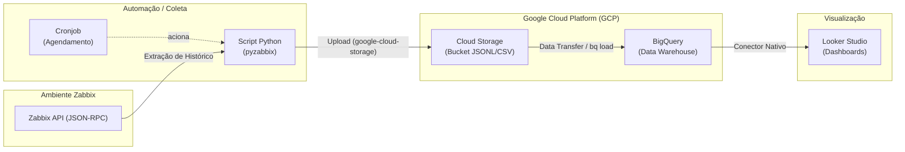

# ☁️ Módulo 2: Enviando dados do Zabbix para o BigQuery

**Duração:** 04:00h | **Instrutor:** Felipe | **Nível:** Avançado

### 📚 Conteúdo Programático
*   Zabbix API
*   Zabbix com Python
*   Enviando dados para Bucket GCP (GCS)
*   Coletando dados com Google BigQuery
*   Conectando BigQuery com Looker Studio
*   Trabalhando com Google Looker Studio
*   Laboratório Prático

---

Este repositório contém o guia prático para extrair dados do Zabbix via API utilizando Python, armazená-los no Google Cloud Storage (GCS) como *staging area*, processá-los no BigQuery para análises históricas profundas e, finalmente, visualizá-los em dashboards dinâmicos no Looker Studio.

---

## 🏗️ Arquitetura da Solução

O fluxo de dados neste módulo tira a carga do banco de dados relacional do Zabbix e utiliza a robustez analítica do Google Cloud.



---

## 🛠️ Laboratório Prático: Passo a Passo

### 1. Pré-requisitos e Dependências
Certifique-se de ter o Python 3.9+ e instale as bibliotecas necessárias para interagir com o Zabbix e as APIs do Google Cloud.

```bash
# Atualizar repositórios e instalar dependências básicas do SO (se necessário)
sudo apt-get update
sudo apt-get install apt-transport-https ca-certificates gnupg curl python3-pip -y

# Instalar pacotes Python
pip install pyzabbix google-cloud-storage google-cloud-bigquery pandas
```

---

### 2. Autenticação e Preparação no GCP
1. Gere um **API Token** no Zabbix (Administração > Usuários > API Tokens). Pare de usar usuário/senha em scripts!
2. No seu servidor/VM, autentique-se na GCP utilizando a Conta de Serviço (a mesma do Módulo 1 ou uma nova com permissão de Storage e BigQuery).

```bash
# Autenticar com a Conta de Serviço
gcloud auth activate-service-account --key-file=SUA_CHAVE.json

# Criar o Bucket no Cloud Storage que servirá de Staging Area
gcloud storage buckets create gs://zabbix-export-instrutor-felipe --location=us-central1
```
> ⚠️ **Atenção às permissões:** A Conta de Serviço precisa do papel **Administrador de objetos do Storage** (ou *Criador de objetos*) para conseguir enviar arquivos para o Bucket.

---

### 3. Script Python: Exportação (Zabbix -> GCS)
Crie o arquivo de script que fará a extração via `pyzabbix` e o upload pro Cloud Storage.

**Arquivo:** `export_zabbix_to_gcs.py`

```python
#!/usr/bin/env python3
"""
export_zabbix_to_gcs.py
Exporta histórico do Zabbix para GCS em formato JSON Lines.
"""
import json, os
from datetime import datetime, timedelta
from pyzabbix import ZabbixAPI
from google.cloud import storage

# ── Configuração ─────────────────────────────────────────────────────
ZABBIX_URL   = os.environ.get("ZABBIX_URL", "http://zabbix.example.com")
ZABBIX_TOKEN = os.environ.get("ZABBIX_TOKEN", "SEU_TOKEN_AQUI")
GCS_BUCKET   = os.environ.get("GCS_BUCKET", "zabbix-export-instrutor-felipe")
GCP_PROJECT  = os.environ.get("GCP_PROJECT", "SEU_PROJECT_ID")

END   = datetime.utcnow()
START = END - timedelta(hours=1)

def get_history(zapi, item_ids, start, end):
    records = []
    for chunk_start in range(int(start.timestamp()), int(end.timestamp()), 3600):
        data = zapi.history.get(
            itemids=item_ids,
            history=0, # 0 = float
            time_from=chunk_start,
            time_till=chunk_start + 3600,
            output='extend',
            limit=10000,
            sortfield='clock',
            sortorder='ASC'
        )
        records.extend(data)
    return records

def main():
    zapi = ZabbixAPI(ZABBIX_URL)
    zapi.login(api_token=ZABBIX_TOKEN)
    print(f"Zabbix version: {zapi.api_version()}")

    # Buscar itens de CPU de todos os hosts
    items = zapi.item.get(
        search={"key_": "system.cpu.util"},
        searchWildcardsEnabled=True,
        output=["itemid", "name", "key_", "hostid", "units"],
        selectHosts=["host"]
    )
    
    item_map = {item["itemid"]: item for item in items}
    item_ids = list(item_map.keys())
    
    # Buscar histórico
    history = get_history(zapi, item_ids, START, END)
    
    # Montar JSON Lines
    lines = []
    for rec in history:
        item = item_map.get(rec["itemid"], {})
        line = {
            "timestamp": datetime.utcfromtimestamp(int(rec["clock"])).isoformat() + "Z",
            "host_name": item.get("hosts", [{}])[0].get("host", "unknown"),
            "item_key":  item.get("key_", ""),
            "item_name": item.get("name", ""),
            "value":     float(rec["value"]),
            "unit":      item.get("units", "")
        }
        lines.append(json.dumps(line))

    jsonl_content = "\n".join(lines)

    # Upload para GCS
    date_path = START.strftime("year=%Y/month=%m/day=%d")
    blob_name = f"zabbix/{date_path}/{START.strftime('%H%M%S')}.jsonl"

    client = storage.Client(project=GCP_PROJECT)
    bucket = client.bucket(GCS_BUCKET)
    blob = bucket.blob(blob_name)
    blob.upload_from_string(jsonl_content, content_type="application/json")
    print(f"Upload concluído: gs://{GCS_BUCKET}/{blob_name}")
    zapi.logout()

if __name__ == "__main__":
    main()
```

Dê permissão de execução ao script:
```bash
chmod +x export_zabbix_to_gcs.py
```

---

### 4. Automação (Cron)
Para garantir que o script e o envio dos arquivos ocorram de forma constante, configuramos o crontab (`crontab -e`).

```bash
# Executa o script Python diariamente às 11:30
30 11 * * * /usr/bin/python3 /caminho/para/seu/script/export_zabbix_to_gcs.py

# Alternativa: Copia arquivos CSV a cada 1 minuto (silenciosamente)
* * * * * /usr/bin/gsutil cp /etc/zabbix/report/repositorio_reports/*.csv gs://zabbix-export-instrutor-felipe/ > /dev/null 2>&1
```

---

### 5. BigQuery (Ingestão de Dados e Consultas)
Com os dados no GCS, precisamos criar a tabela no BigQuery e carregar essas informações.

```bash
# 1. Criar Dataset
bq mk --project_id=SEU_PROJECT_ID zabbix_metrics

# 2. Criar tabela particionada (Otimiza custos e velocidade de consultas)
bq mk --project_id=SEU_PROJECT_ID \
  --table \
  --time_partitioning_field=timestamp \
  --time_partitioning_type=DAY \
  --clustering_fields=host_name,item_key \
  zabbix_metrics.history \
  timestamp:TIMESTAMP,host_name:STRING,item_key:STRING,item_name:STRING,value:FLOAT64,unit:STRING

# 3. Carregar os dados (Ingestão do Bucket para o BigQuery)
bq load \
  --project_id=SEU_PROJECT_ID \
  --source_format=NEWLINE_DELIMITED_JSON \
  --autodetect \
  zabbix_metrics.history \
  "gs://zabbix-export-instrutor-felipe/zabbix/year=*/month=*/day=*/*.jsonl"
```

#### 🔍 Consultas de Validação no BigQuery
```sql
-- Top 10 hosts por média de CPU na última semana
SELECT
  host_name,
  AVG(value) AS avg_cpu,
  MAX(value) AS max_cpu
FROM `zabbix_metrics.history`
WHERE item_key LIKE '%cpu.util%'
  AND timestamp >= TIMESTAMP_SUB(CURRENT_TIMESTAMP(), INTERVAL 7 DAY)
GROUP BY host_name
ORDER BY avg_cpu DESC
LIMIT 10;
```

---

### 6. Looker Studio (Visualização)
Para gerar relatórios e dashboards dinâmicos sem a necessidade de print screens:

1. Acesse [Looker Studio](https://lookerstudio.google.com).
2. Clique em **Criar** > **Relatório**.
3. Selecione o conector do **BigQuery**.
4. Navegue até: *Seu Projeto* > *Dataset (`zabbix_metrics`)* > *Tabela (`history`)*.
5. Adicione um **Gráfico de Série Temporal**:
   - **Dimensão:** Hora / `timestamp`
   - **Métrica:** `AVG(value)` (Nomeada como Média de CPU)
   - **Filtros:** Adicione um controle de filtragem pelo campo `item_key`.

> 💡 **Dica PRO:** Use *Campos Calculados* no Looker Studio para categorizar eventos: 
> `CASE WHEN avg_cpu > 90 THEN "Crítico" WHEN avg_cpu > 70 THEN "Alerta" ELSE "Normal" END`
